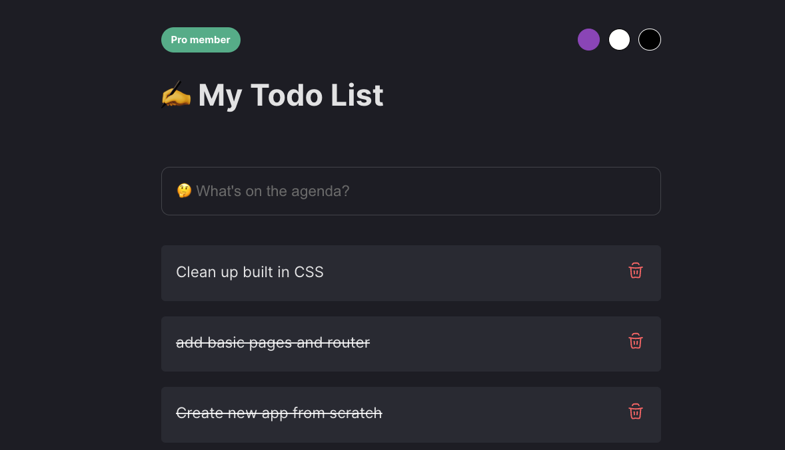

# Appwrite 🤝 React

Appwrite + React fullstack todo app with integrated auth.

## Understanding Folder Structure

This project is part of a multi part video series, so our folders are structured in a way to represent the code at the end of each video. i.e. `Video 1` == `Part 1`, and so on.

<table>
    <tr>
        <th>Part</th>
        <th>Topic</th>
        <th>Description</th>
        <th>View</th>
    </tr>
    <tr>
        <td>1</td>
        <td>CRUD</td>
        <td>Basic setup and CRUD with Appwrite + React</td>
        <td><a href="/Part-1/">View</a></td>
    </tr>
    <tr>
        <td>2</td>
        <td>Theme Switcher</td>
        <td>Added theme switcher</td>
        <td><a href="/Part-2/">View</a></td>
    </tr>
    <tr>
        <td>2</td>
        <td>Theme Switcher (Template Only)</td>
        <td>Theme switcher with no backend.</td>
        <td><a href="/Part-2-Template-only">View</a></td>
    </tr>
    <tr>
        <td>3</td>
        <td>Authentication</td>
        <td>Login, Logout, Registration & Protected Routes</td>
        <td><a href="/Part-3/">View</a></td>
    </tr>
<table/>

See tutorial part 1 here: https://youtu.be/_JDeJgsU-bI



## Setup instructions

Before you can clone and setup a local instance of this project you'll need to setup an Appwrite backend and gain the nessesary credentials + have the correct database setup and permisisons configured.

### Setting up appwrite backend

1. Create a new appwrite project + app. Easiest way to get started is by heading to [appwrite.io](https://appwrite.io/)

2. Add a platform and set hostname registration

This can be done by going to `overview` -> `Add Platform` -> `Web App`.

3. Add a user

4. Add a database and a collection

Add the following attributes in your collection

<table>
    <tr>    
        <th>Name</th>
        <th>Type</th>
        <th>Details</th>
    <tr>
    <tr>    
        <td>body</td>
        <td>string</td>
        <td>100 chars</td>
    <tr>
    <tr>    
        <td>completed</td>
        <td>boolean</td>
        <td>Default to false</td>
    <tr>
</table>

5. Set collection perissions

This can be done under from your collection tab unde `settings` -> `permissions`.

Set permissions to `users` + `create`

Enable document level security

#### Setup local repo

**Clone Repo**
Clone repo: `git clone <repo url>`

Add `.env` file and fill in your Appwrite project credentials:

```
VITE_PROJECT_ID=YOUR-PROJECT-ID
VITE_DATABASE_ID=YOUR-DATABASE-ID
VITE_COLLECTION_TASKS=YOUR-COLLECTION-ID
```

-   `cd <PART #>`
-   `npm i` && `npm run dev`
